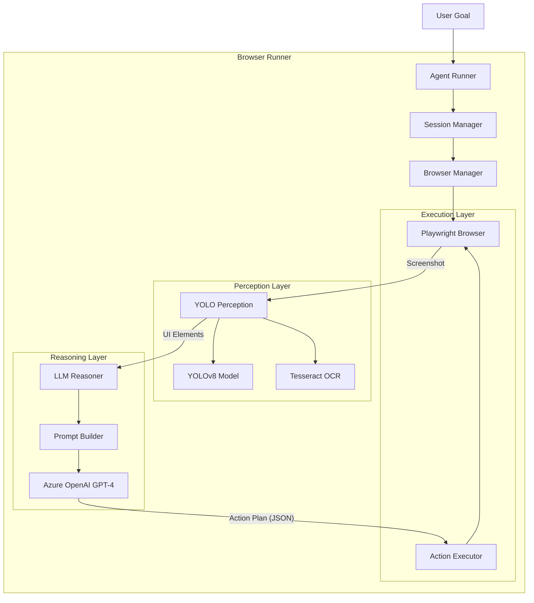

# 🤖 Browser Automation With Computer Vision

<div align="center">


**Next-Gen Web Automation powered by Computer Vision & LLM Reasoning**

[Features](#-features) • [Quick Start](#-quick-start) • [Configuration](#-configuration) • [Architecture](#-architecture)

</div>

---

## 🚀 Overview

The **Browser Automation With Computer Vision** is an advanced web automation tool that "sees" and "thinks" like a human. Unlike traditional scrapers that rely on brittle CSS selectors, this agent uses **YOLO computer vision** to detect UI elements and **LLM reasoning** to plan interactions dynamically.

It is designed to handle complex, multi-step workflows on dynamic websites, making it resilient to layout changes and capable of achieving high-level goals.

## ✨ Features

- **👁️ Computer Vision Perception**: Uses a fine-tuned YOLO model to detect buttons, inputs, and links visually from screenshots.
- **🧠 AI Reasoning Engine**: Leverages Azure OpenAI (GPT-4o) to analyze the UI state and plan the optimal next action.
- **🛡️ Robust Browser Automation**: Built on Playwright for reliable, cross-browser execution with anti-detection measures.
- **⚙️ Advanced Browser Profile**: Fine-grained control over browser fingerprints, extensions, proxies, and context settings.
- **📝 OCR Integration**: Extracts text from detected elements using Tesseract/PaddleOCR for semantic understanding.
- **🎥 Visual Debugging**: Records session videos and saves step-by-step screenshots with annotated detections.

## ⚡ Quick Start

### Prerequisites

- Python 3.12+
- Azure OpenAI API Access
- Tesseract OCR (for text extraction)

### Installation

1. **Clone the repository**
   ```bash
   git clone https://github.com/gourabsen21s/agentic-product-scraper.git
   cd agentic-product-scraper
   ```

2. **Set up environment**
   ```bash
   python3 -m venv .venv
   source .venv/bin/activate  # Windows: .venv\Scripts\activate
   pip install -r requirements.txt
   playwright install chromium
   ```

3. **Configure credentials**
   Create a `.env` file:
   ```env
   AZURE_OPENAI_BASE=https://your-resource.openai.azure.com/
   AZURE_OPENAI_KEY=your_api_key
   AZURE_DEPLOYMENT=gpt-4o
   AZURE_API_VERSION=2024-02-15-preview
   ```

### Usage

Run the agent with a natural language goal:

```bash
# Search for products
python scripts/run_agent.py "Go to amazon.com and search for 'gaming laptop'"

# Complex navigation
python scripts/run_agent.py "Go to youtube.com, search for 'lofi hip hop', and play the first video"
```

## 🔧 Configuration

The agent is highly configurable via environment variables or `.env` file.

| Variable | Description | Default |
| :--- | :--- | :--- |
| `BM_HEADLESS` | Run browser in headless mode | `false` |
| `BM_BROWSER_EXEC_PATH` | Custom path to browser executable | `None` |
| `BM_VIEWPORT_W` | Browser viewport width | `1440` |
| `BM_VIEWPORT_H` | Browser viewport height | `900` |
| `BM_LOG_LEVEL` | Logging verbosity (DEBUG, INFO, ERROR) | `INFO` |
| `BM_YOLO_MODEL_PATH` | Path to YOLO detection model | `models/web_detect_best_m.pt` |
| `BM_USER_DATA_DIR` | Directory for persistent user data | `~/.browser-runner/user_data` |
| `AZURE_OPENAI_BASE` | Azure OpenAI Endpoint URL | Required |
| `AZURE_OPENAI_KEY` | Azure OpenAI API Key | Required |
| `AZURE_DEPLOYMENT` | Deployment name for GPT-4 | `gpt-4o` |

## 🏗️ Architecture

The system follows a cyclic **Perception-Reasoning-Action** loop, orchestrated by the `SessionManager`.



### Data Flow
1.  **Initialization**: `BrowserManager` launches a configured browser instance using `BrowserProfile`.
2.  **Observation**: `SessionManager` captures a screenshot of the current page.
3.  **Perception**: 
    *   `YOLOPerception` detects UI elements (buttons, inputs, etc.) and their bounding boxes.
    *   OCR extracts text from these regions to provide semantic context.
4.  **Reasoning**: 
    *   `Reasoner` constructs a prompt containing the user goal, detected elements, and action history.
    *   LLM generates a structured JSON action (e.g., `{"action": "click", "target": {"by": "id", "value": "search_btn"}}`).
5.  **Execution**: `ActionExecutor` translates the JSON action into Playwright commands to interact with the page.

## 📂 Project Structure

<details>
<summary>Click to expand file tree</summary>

```text
browser-runner/
├── api/                        # FastAPI server for remote control
│   ├── routes/                 # API endpoints (plan_execute, session, etc.)
│   └── main.py                 # Server entry point
├── reasoner/                   # AI Reasoning Module
│   ├── prompts/                # Prompt templates and few-shot examples
│   ├── reasoner.py             # Core reasoning logic & LLM integration
│   └── schemas.py              # Pydantic models for Action/Target
├── runner/                     # Core Execution Engine
│   ├── perception/             # Computer Vision Module
│   │   ├── yolo_perception.py  # YOLOv8 + OCR implementation
│   │   └── ui_element.py       # UI Element data models
│   ├── browser_manager.py      # Browser lifecycle & health monitoring
│   ├── browser_profile.py      # Advanced browser configuration
│   ├── session_manager.py      # Session state & artifact management
│   ├── action_executor.py      # Playwright action implementation
│   ├── config.py               # Global configuration
│   └── logger.py               # Structured logging
├── scripts/                    # CLI Tools
│   └── run_agent.py            # Main entry point for running the agent
├── tests/                      # Test Suite
│   └── test_browser_profile.py # Configuration tests
├── models/                     # ML Models
│   └── web_detect_best_m.pt    # Fine-tuned YOLO weights
└── artifacts/                  # Session outputs (screenshots, videos, logs)
```
</details>

## 🗺️ Roadmap

- [ ] **Multi-Tab Support**: Handle complex workflows involving multiple tabs.
- [ ] **DOM Tree Integration**: Hybrid perception combining visual and DOM data.
- [ ] **Self-Correction**: Automatic recovery from failed actions.
- [ ] **Parallel Execution**: Run multiple agents concurrently.

## ❓ Troubleshooting

<details>
<summary><b>Browser fails to launch</b></summary>

- Ensure Playwright browsers are installed: `playwright install chromium`
- Check `BM_BROWSER_EXEC_PATH` is correct if set.
- Verify no other Chrome instances are locking the user data directory.
</details>

<details>
<summary><b>LLM Validation Error</b></summary>

- Ensure `AZURE_DEPLOYMENT` matches your Azure OpenAI deployment name.
- Check logs for raw LLM output to debug prompt issues.
</details>

## 🤝 Contributing

Contributions are welcome! Please read our [Contributing Guide](CONTRIBUTING.md) for details on our code of conduct and the process for submitting pull requests.

## 📄 License

This project is licensed under the MIT License - see the [LICENSE](LICENSE) file for details.

---

<div align="center">
  <sub>Built with ❤️ by the Agentic Coding Team</sub>
</div>
